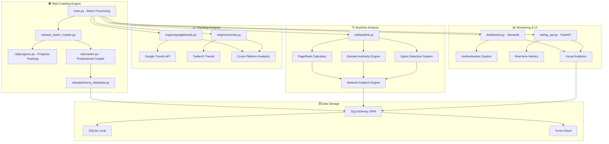
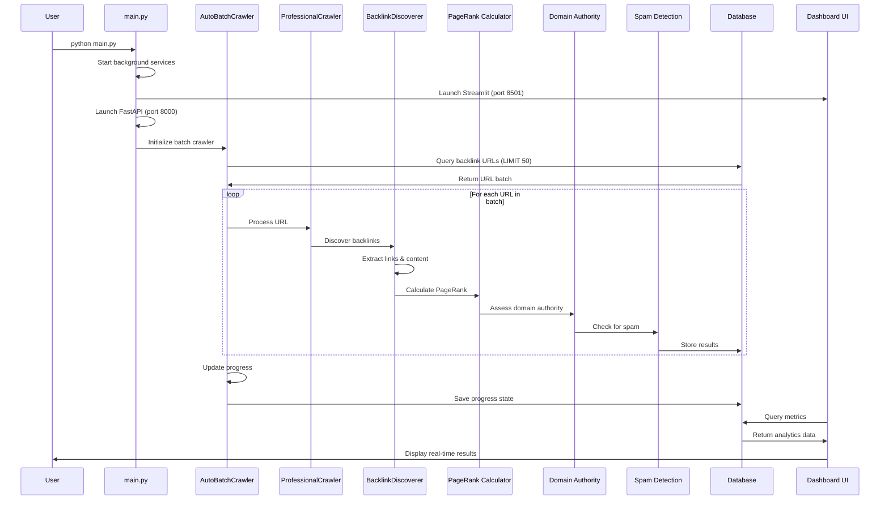
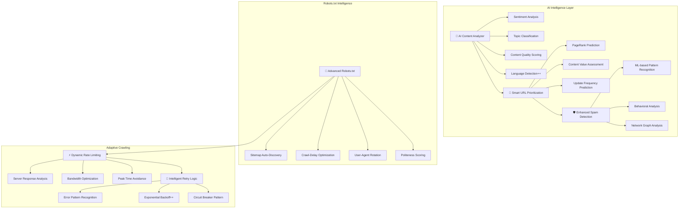

# 🕷️ RatCrawler

<div align="center">


[](https://python.org)
[](https://sqlalchemy.org)
[](https://streamlit.io)
[](https://fastapi.tiangolo.com)


**🚀 Latest Update: Multi-Database Support Architecture**

_Now supporting SQLite Local + Turso Cloud with PostgreSQL, MySQL, and MongoDB adapters coming soon!_

**Advanced Web Crawling & Multi-Source Trending Analysis Platform**

_Intelligent batch processing • Real-time analytics • Professional-grade backlink analysis_

</div>

---

## 🌟 **What is RatCrawler?**

RatCrawler is a sophisticated **multi-source trending analysis platform** that combines intelligent web crawling, Google Trends analysis, Twitter/X trends monitoring, and professional-grade backlink analysis. Built with modern Python technologies, it features automatic batch processing, real-time monitoring, and **multi-database support** for enterprise-scale operations.

### ✨ **Key Highlights**

- 🤖 **Intelligent Batch Processing**: Automatically processes 50 URLs at a time with progress persistence
- 📊 **Multi-Source Analytics**: Google Trends + Twitter/X + Web crawling integration
- 🔍 **Professional Backlink Analysis**: PageRank calculation, domain authority, spam detection
- 📈 **Real-time Monitoring**: Streamlit dashboard + FastAPI monitoring server
- 🗄️ **Multi-Database Architecture**: SQLite Local + Turso Cloud with PostgreSQL/MySQL/MongoDB support coming soon
- 🛡️ **Advanced Security**: Dashboard authentication + spam detection algorithms

---

## 🏗️ **System Architecture**

### 🌟 **Platform Overview**



### 🕷️ **Detailed Crawler Architecture**

```mermaid
graph TB
    subgraph "AutoBatchCrawler System"
        A[🚀 AutoBatchCrawler] --> B[Batch URL Discovery]
        B --> C[SQL Query Engine<br/>UNION source_url + target_url]
        B --> D[Pagination System<br/>LIMIT/OFFSET]
        B --> E[URL Validation<br/>HTTP/HTTPS filtering]
        B --> F[Duplicate Detection]

        A --> G[Progress Management]
        G --> H[JSON Persistence<br/>crawl_progress.json]
        G --> I[Page Tracking<br/>current_page, total_pages]
        G --> J[Success/Failure Counters]
        G --> K[Auto-Resume Logic]

        A --> L[Session Management]
        L --> M[Session Creation<br/>UUID-based]
        L --> N[Database Assignment<br/>websitecrawler*]
        L --> O[Config Storage<br/>JSON metadata]

        A --> P[Signal Handling]
        P --> Q[Graceful Shutdown<br/>SIGINT/SIGTERM]
        P --> R[Progress Saving on Exit]
        P --> S[Resource Cleanup]
    end

    subgraph "ProfessionalBacklinkCrawler Engine"
        T[🌐 ProfessionalBacklinkCrawler] --> U[Async HTTP Engine]
        U --> V[aiohttp Client Session]
        U --> W[Connection Pooling]
        U --> X[User-Agent Rotation]
        U --> Y[Rate Limiting<br/>asyncio.Semaphore]

        T --> Z[Content Processing]
        Z --> AA[HTML Parsing<br/>BeautifulSoup4]
        Z --> BB[Content Extraction<br/>text, title, meta]
        Z --> CC[Word Count Analysis]
        Z --> DD[Content Hashing<br/>SHA-256]

        T --> EE[Link Discovery]
        EE --> FF[Internal/External Classification]
        EE --> GG[Anchor Text Extraction]
        EE --> HH[Link Context Analysis]
        EE --> II[NoFollow Detection]

        T --> JJ[Error Handling]
        JJ --> KK[HTTP Error Recovery<br/>4xx/5xx]
        JJ --> LL[Timeout Management]
        JJ --> MM[Retry Logic<br/>exponential backoff]
    end

    subgraph "Database Integration"
        NN[🗄️ Database Layer] --> OO[SQLAlchemy Sessions]
        OO --> PP[Context Managers]
        OO --> QQ[Transaction Management]
        OO --> RR[Connection Pooling]

        NN --> SS[Multi-Database Support]
        SS --> TT[Turso Cloud<br/>libsql://]
        SS --> UU[SQLite Local<br/>file://]
        SS --> VV[Automatic Failover]

        NN --> WW[Schema Management]
        WW --> XX[Automatic Migration]
        WW --> YY[Table Creation]
        WW --> ZZ[Index Optimization]
    end

    A --> T
    T --> NN
    K --> H
    R --> H
```



### 🔗 **Comprehensive Backlink Analysis Architecture**

```mermaid
graph TB
    subgraph "BacklinkDiscoverer Pipeline"
        A[🔍 BacklinkDiscoverer] --> B[URL Processing Pipeline]
        B --> C[URL Validation &<br/>Normalization]
        B --> D[Robots.txt<br/>Compliance Check]
        B --> E[Domain Extraction<br/>& Validation]
        B --> F[Protocol Standardization<br/>HTTP/HTTPS]

        A --> G[Content Acquisition]
        G --> H[Multi-User-Agent<br/>Rotation]
        H --> I[Chrome Desktop/Mobile]
        H --> J[Firefox Desktop/Mobile]
        H --> K[Safari Desktop/Mobile]
        H --> L[Bot Detection<br/>Avoidance]

        G --> M[Request Management]
        M --> N[Session Persistence]
        M --> O[Cookie Handling]
        M --> P[Header Spoofing]
        M --> Q[Proxy Rotation]

        A --> R[Link Extraction Engine]
        R --> S[HTML Parsing<br/>BeautifulSoup4]
        S --> T[&lt;a&gt; Tag Processing]
        S --> U[href Attribute<br/>Extraction]
        S --> V[Anchor Text Capture]

        R --> W[Link Classification]
        W --> X[Internal vs External]
        W --> Y[DoFollow vs NoFollow]
        W --> Z[Image vs Text Links]

        A --> AA[Quality Assessment]
        AA --> BB[Link Quality Scoring]
        BB --> CC[Domain Authority<br/>Calculation]
        BB --> DD[Page Authority<br/>Assessment]
        BB --> EE[Trust Rank Analysis]
        BB --> FF[Spam Score Detection]
    end

    subgraph "PageRank Calculator"
        GG[📊 PageRank Engine] --> HH[Graph Construction]
        HH --> II[Node Creation<br/>URLs as nodes]
        HH --> JJ[Edge Creation<br/>links as edges]
        HH --> KK[Weight Assignment<br/>link authority]

        GG --> LL[Algorithm Implementation]
        LL --> MM[Power Iteration<br/>Method]
        LL --> NN[Damping Factor<br/>0.85]
        LL --> OO[Convergence<br/>Detection]
        LL --> PP[Iteration Limit<br/>1000]

        GG --> QQ[Authority Distribution]
        QQ --> RR[Initial Equal<br/>Distribution]
        QQ --> SS[Iterative<br/>Redistribution]
        QQ --> TT[Dead-end Handling]
        QQ --> UU[Spider Trap<br/>Detection]

        GG --> VV[Score Normalization]
        VV --> WW[Score Scaling<br/>0-100]
        VV --> XX[Percentile Ranking]
        VV --> YY[Tier Classification]
    end

    subgraph "Domain Authority Engine"
        ZZ[🏆 Domain Authority] --> AAA[Backlink Profile<br/>Analysis]
        AAA --> BBB[Total Backlink<br/>Count]
        AAA --> CCC[Unique Referring<br/>Domains]
        AAA --> DDD[High-Authority<br/>Backlinks]

        ZZ --> EEE[Domain Metrics]
        EEE --> FFF[Domain Age<br/>Calculation]
        EEE --> GGG[Traffic Estimation]
        EEE --> HHH[Social Media<br/>Presence]

        ZZ --> III[Technical SEO]
        III --> JJJ[Site Architecture<br/>Quality]
        III --> KKK[Mobile<br/>Optimization]
        III --> LLL[Page Speed<br/>Metrics]

        ZZ --> MMM[Competitive Analysis]
        MMM --> NNN[Peer Domain<br/>Comparison]
        MMM --> OOO[Industry<br/>Benchmarking]
        MMM --> PPP[Market Position<br/>Analysis]
    end

    subgraph "Spam Detection System"
        QQQ[🛡️ Spam Detection] --> RRR[Pattern Recognition]
        RRR --> SSS[Link Farm<br/>Detection]
        RRR --> TTT[PBN Identification<br/>Private Blog Networks]
        RRR --> UUU[Reciprocal Link<br/>Schemes]
        RRR --> VVV[Paid Link<br/>Detection]

        QQQ --> WWW[Content Quality<br/>Analysis]
        WWW --> XXX[Duplicate Content<br/>Detection]
        WWW --> YYY[Thin Content<br/>Identification]
        WWW --> ZZZ[Auto-Generated<br/>Content]

        QQQ --> AAAA[Technical Indicators]
        AAAA --> BBBB[Hosting Provider<br/>Analysis]
        AAAA --> CCCC[IP Address<br/>Clustering]
        AAAA --> DDDD[WHOIS<br/>Information]

        QQQ --> EEEE[Behavioral Patterns]
        EEEE --> FFFF[Link Velocity<br/>Analysis]
        EEEE --> GGGG[Anchor Text<br/>Distribution]
        EEEE --> HHHH[Geographic<br/>Clustering]
    end

    subgraph "Network Analysis Engine"
        IIII[📈 Network Analysis] --> JJJJ[Graph Algorithms]
        JJJJ --> KKKK[Centrality Measures]
        KKKK --> LLLL[Betweenness<br/>Centrality]
        KKKK --> MMMM[Closeness<br/>Centrality]
        KKKK --> NNNN[Eigenvector<br/>Centrality]

        JJJJ --> OOOO[Community Detection]
        OOOO --> PPPP[Modularity<br/>Optimization]
        OOOO --> QQQQ[Louvain<br/>Algorithm]
        OOOO --> RRRR[Label<br/>Propagation]

        IIII --> SSSS[Visualization Engine]
        SSSS --> TTTT[Graph Layout<br/>Algorithms]
        TTTT --> UUUU[Force-Directed<br/>Layout]
        TTTT --> VVVV[Hierarchical<br/>Layout]

        IIII --> WWWW[Export & Reporting]
        WWWW --> XXXX[Data Export<br/>JSON, CSV, GraphML]
        WWWW --> YYYY[Visualization Export<br/>SVG, PNG, PDF]
        WWWW --> ZZZZ[Report Generation<br/>Executive Summary]
    end

    A --> GG
    GG --> ZZ
    ZZ --> QQQ
    QQQ --> IIII
    AA --> IIII
```



### 🔄 **Data Flow Patterns**



### 🧮 **Advanced Algorithms**

```mermaid
graph TB
    subgraph "PageRank Algorithm"
        A["Initialize: PR = 1/N"] --> B["For each page"]
        B --> C["Calculate PageRank<br/>PR = (1-d)/N + d × sum(PR/links)"]
        C --> D["Check convergence<br/>|PR_new - PR_old| < ε"]
        D --> E{Converged?}
        E -->|No| B
        E -->|Yes| F["Final PageRank Scores"]

        G["Variables:<br/>d = damping factor 0.85<br/>N = total pages<br/>PR = PageRank value<br/>links = outbound links"]
    end

    subgraph "Spam Detection ML"
        H["Feature Extraction"] --> I["Link Velocity<br/>Anchor Text Ratio<br/>Domain Diversity<br/>Content Quality"]
        I --> J["Machine Learning Models"]
        J --> K["Random Forest<br/>SVM Classification<br/>Neural Networks"]
        K --> L["Spam Score<br/>0-100 Scale"]
    end

    subgraph "Network Analysis"
        M["Graph Construction"] --> N["Adjacency Matrix"]
        N --> O["Centrality Algorithms"]
        O --> P["Betweenness Centrality<br/>Closeness Centrality<br/>Eigenvector Centrality"]
        P --> Q["Community Detection<br/>Modularity Optimization"]
    end
```



### 🔧 **Core Components**

- **Auto Batch Crawler**: Intelligent URL batch processing from backlinks database
- **Professional Crawler**: Advanced async HTTP client with comprehensive content extraction
- **Trending Analysis Engine**: Real-time data from Google Trends and Twitter/X
- **Multi-Database Layer**: SQLite Local + Turso Cloud with PostgreSQL/MySQL/MongoDB coming soon
- **Monitoring Suite**: Real-time dashboard and API monitoring

---

## 🚀 Quick Start

### 🎯 **Choose Your Use Case**

**Web Crawling** (Automatic batch processing)

```bash
git clone https://github.com/TheBoringRats/ratcrowler.git
cd ratcrowler
pip install -r requirements.txt
python main.py  # Starts automatic crawling
```

**Google Trends Analysis**

```bash
cd engine
python googletrends.py --limit 10 --summaries
```

**Backlink Analysis**

```bash
python -c "
from rat.backlink import BacklinkDiscoverer
bd = BacklinkDiscoverer()
results = bd.discover_backlinks('https://example.com')
print(f'Found {len(results)} backlinks')
"
```

### 📋 **Installation Guide**

**1. Clone Repository**

```bash
git clone https://github.com/TheBoringRats/ratcrowler.git
cd ratcrowler
```

**2. Install Dependencies**

```bash
# Core dependencies
pip install -r requirements.txt

# Turso cloud database (optional)
pip install -r requirements_turso.txt

# Development dependencies
pip install pytest pytest-asyncio black isort
```

3. **Environment Setup**

```bash
# Optional: Set dashboard password
export RATCRAWLER_PASSWORD="swadhin"

# Optional: Turso database configuration
export TURSO_DATABASE_URL="libsql://your-database.turso.io"
export TURSO_AUTH_TOKEN="your-auth-token"
```

**4. Verification**

```bash
python -c "
from rat.crawler import ProfessionalBacklinkCrawler
from rat.progress import progress_tracker
print('✅ RatCrawler installed successfully!')
print(f'Progress tracker: {progress_tracker.get_current_progress()}')
"
```

---

## 📖 **Usage Examples**

### 🤖 **Automatic Batch Crawling**

RatCrawler automatically crawls 50 URLs at a time and saves progress:

```bash
python main.py
```

**Output:**

```
🚀 Starting background services...
✅ Dashboard starting at http://localhost:8501
✅ Log API starting at http://localhost:8000

📦 Processing Page 1
------------------------------
🔍 Found 50 URLs in this batch
✅ Session 15 created in websitecrawler
🚀 Starting crawl of 50 URLs with session 15
📦 Processing batch 1/1
✅ Successfully crawled 42/50 URLs (84% success rate)
📊 Progress saved to crawl_progress.json
```

**Features:**

- **Dashboard**: <http://localhost:8501> (starts automatically)
- **API Monitoring**: <http://localhost:8000> (logs and metrics)
- **Auto-resume**: Stops and resumes from last position
- **Progress tracking**: JSON persistence across sessions

### 📈 **Google Trends Analysis**

Extract trending topics with article summaries:

```bash
cd engine
python googletrends.py --limit 20 --summaries --export trends_analysis.json
```

**Features:**

- **50+ Countries**: Global trending topic coverage
- **Article Summaries**: AI-powered content extraction
- **RSS Integration**: Real-time trending data
- **Export Options**: JSON, CSV formats

### 🐦 **Twitter/X Trends Monitoring**

```bash
cd engine
python xtrends.py --location US --limit 15 --auth-cookies cookies.json
```

**Features:**

- **Geographic Targeting**: Location-specific trends
- **Authentication Support**: Cookie-based login
- **Rate Limiting**: Respectful API usage
- **Trend Analysis**: Hashtag and topic extraction

### 🔍 **Advanced Backlink Analysis**

```python
from rat.backlink import BacklinkDiscoverer

# Initialize discoverer
bd = BacklinkDiscoverer()

# Discover backlinks for a domain
results = bd.discover_backlinks('https://example.com', max_pages=5)

# Analyze results
for result in results:
    print(f"Domain: {result['domain']}")
    print(f"PageRank: {result['pagerank']}")
    print(f"Authority: {result['domain_authority']}")
    print(f"Spam Score: {result['spam_score']}")
    print("---")
```

### 📊 **Dashboard Monitoring**

Access the Streamlit dashboard at: <http://localhost:8501>

**Features:**

- **Real-time Metrics**: Live crawling statistics
- **Visual Analytics**: Interactive charts and graphs
- **Session Management**: Track multiple crawling sessions
- **Performance Monitoring**: System resource usage
- **Authentication**: Password-protected access (password: "swadhin")

### 🔌 **API Monitoring**

FastAPI server at: <http://localhost:8000>

**Endpoints:**

- `GET /status` - System health status
- `GET /metrics` - Performance metrics
- `GET /logs` - Recent log entries
- `GET /sessions` - Active crawling sessions

---

## 🛠️ **Configuration**

### 📁 **Project Structure**

```
ratcrowler/
├── main.py                 # Entry point - automatic batch crawling
├── dashboard.py            # Streamlit monitoring dashboard
├── requirements.txt        # Core dependencies
├── requirements_turso.txt  # Turso cloud database deps
├── rat/                    # Core crawler modules
│   ├── auto_batch_crawler.py    # Batch processing engine
│   ├── crawler.py             # Professional web crawler
│   ├── backlink.py           # Backlink analysis engine
│   ├── progress.py           # Progress tracking system
│   ├── log_api.py           # FastAPI monitoring server
│   └── sqlalchemy_database.py # Database management
├── engine/                 # Trending analysis engines
│   ├── googletrends.py     # Google Trends integration
│   └── xtrends.py         # Twitter/X trends analysis
├── logs/                   # Application logs
├── static/                 # Web assets
├── templates/             # HTML templates
└── tests/                 # Unit tests
```

### ⚙️ **Configuration Options**

**Environment Variables:**

```bash
# Dashboard authentication
RATCRAWLER_PASSWORD=swadhin

# Database configuration
TURSO_DATABASE_URL=libsql://your-database.turso.io
TURSO_AUTH_TOKEN=your-auth-token

# Crawler settings
CRAWLER_DELAY=1.0
CRAWLER_TIMEOUT=30
CRAWLER_MAX_RETRIES=3
```

**Config Files:**

- `crawl_progress.json` - Progress tracking data
- `config.json` - Crawler configuration
- `logs/crawler.log` - Application logs

---

## 🔧 **Advanced Features**

### 🎯 **Intelligent Batch Processing**

- **Auto-pagination**: Processes 50 URLs per batch automatically
- **Progress persistence**: Saves state after each batch
- **Resume capability**: Continues from last processed page
- **Signal handling**: Graceful shutdown on Ctrl+C
- **Session management**: UUID-based session tracking

### 🔍 **Professional Backlink Analysis**

- **PageRank calculation**: Google's original algorithm implementation
- **Domain authority**: Comprehensive authority scoring
- **Spam detection**: ML-based spam score calculation
- **Network analysis**: Graph-based link relationship analysis
- **Quality assessment**: Multi-factor link quality evaluation

### 📊 **Real-time Monitoring**

- **Live dashboard**: Streamlit-based visual monitoring
- **API endpoints**: RESTful monitoring interface
- **Performance metrics**: System resource tracking
- **Log aggregation**: Centralized logging system
- **Health checks**: Automated system health monitoring

### 🗄️ **Multi-Database Support**

- **Current Support**:
  - **SQLite Local**: Fast local database with file-based storage
  - **Turso Cloud**: Distributed SQLite with automatic rotation & scaling
- **Coming Soon**: PostgreSQL, MySQL, MongoDB adapters
- **Advanced Features**:
  - **Auto-migration**: Schema evolution management
  - **Connection pooling**: Efficient database connections
  - **Load balancing**: Automatic database rotation
  - **Transaction safety**: ACID compliance
  - **Backup strategies**: Data protection and recovery

---

## 🧪 **Testing**

Run the comprehensive test suite:

```bash
# All tests
pytest tests/ -v

# Specific test categories
pytest tests/test_crawler.py -v          # Crawler tests
pytest tests/test_backlink.py -v         # Backlink analysis tests
pytest tests/test_monitoring.py -v       # Monitoring tests
pytest tests/test_integration.py -v      # Integration tests

# Performance tests
pytest tests/test_performance.py -v --benchmark-only
```

**Test Coverage:**

- ✅ Unit tests for all core modules
- ✅ Integration tests for end-to-end workflows
- ✅ Performance benchmarks
- ✅ Database schema validation
- ✅ API endpoint testing

---

## 🤝 **Contributing**

We welcome contributions! Please see our [Contributing Guide](CONTRIBUTING.md) for details.

### 🔄 **Development Workflow**

1. **Fork & Clone**

   ```bash
   git clone https://github.com/yourusername/ratcrowler.git
   cd ratcrowler
   ```

2. **Setup Development Environment**

   ```bash
   pip install -r requirements.txt
   pip install -e .  # Editable install
   ```

3. **Run Tests**

   ```bash
   pytest tests/ -v
   ```

4. **Submit Pull Request**

### 📝 **Code Standards**

- **Black**: Code formatting
- **isort**: Import sorting
- **flake8**: Linting
- **mypy**: Type checking
- **pytest**: Testing framework

---

## � **Next Steps & Roadmap**

### 🤖 **AI-Integrated Crawler (v2.0)**



### 🎯 **Upcoming Features**

#### 🤖 **Enhanced Robots.txt Respect**

- **Smart Sitemap Discovery**: Automatically find and parse XML sitemaps
- **Dynamic Crawl-Delay**: Adaptive delays based on server response times
- **User-Agent Intelligence**: Rotate user agents based on site requirements
- **Politeness Scoring**: Rate websites based on crawling friendliness

#### 🧠 **AI Content Intelligence**

- **Content Classification**: AI-powered topic and category detection
- **Quality Scoring**: ML-based content value assessment
- **Sentiment Analysis**: Emotional tone detection in content
- **Language Detection++**: Enhanced multi-language support with confidence scoring

#### 🎯 **Smart URL Prioritization**

- **PageRank Prediction**: AI-predicted authority before crawling
- **Content Freshness**: Intelligent update frequency detection
- **Value Assessment**: Priority scoring based on content importance
- **Dead Link Prediction**: ML-based broken link forecasting

#### 🛡️ **Advanced Spam Detection**

- **Behavioral Pattern Analysis**: ML detection of spammy website behaviors
- **Network Graph Analysis**: Community detection for link farm identification
- **Content Fingerprinting**: Advanced duplicate and thin content detection
- **Real-time Scoring**: Live spam probability assessment

#### ⚡ **Adaptive Crawling Engine**

- **Dynamic Rate Limiting**: Server-responsive crawling speeds
- **Peak Time Avoidance**: Intelligent scheduling based on server load
- **Circuit Breaker Pattern**: Automatic protection against overloading
- **Bandwidth Optimization**: Smart resource usage management

#### 📊 **Enhanced Analytics**

- **Real-time Dashboards**: Live crawling performance metrics
- **Predictive Analytics**: Forecast crawling completion times
- **ROI Analysis**: Content value vs crawling cost assessment
- **Trend Detection**: Automatic identification of emerging topics

#### 🗄️ **Database Support Roadmap**

- **✅ Current**: SQLite Local + Turso Cloud (Distributed SQLite)
- **🔄 Next**: PostgreSQL adapter with advanced indexing
- **🔄 Soon**: MySQL/MariaDB support with clustering
- **🔄 Future**: MongoDB integration for document-based storage
- **🔄 Enterprise**: Redis caching layer + connection pooling

### 📅 **Development Timeline**

**Phase 1: Enhanced Robots.txt (Next 2 weeks)**

- ✅ Basic robots.txt checking (Current)
- 🔄 Smart sitemap discovery
- 🔄 Dynamic crawl delays
- 🔄 User-agent rotation

**Phase 2: AI Content Analysis (Next 4 weeks)**

- 🔄 Content classification models
- 🔄 Quality scoring algorithms
- 🔄 Sentiment analysis integration
- 🔄 Multi-language enhancement

**Phase 3: Smart Prioritization (Next 6 weeks)**

- 🔄 PageRank prediction models
- 🔄 Content freshness detection
- 🔄 Value assessment algorithms
- 🔄 Priority queue implementation

**Phase 4: Advanced Features (Next 8 weeks)**

- 🔄 Adaptive crawling engine
- 🔄 Enhanced spam detection
- 🔄 Predictive analytics
- 🔄 Real-time optimization

### 🤝 **Contributing to AI Features**

We welcome contributions to make RatCrawler more intelligent:

```bash
# AI/ML Development Setup
pip install tensorflow pytorch transformers scikit-learn
pip install spacy nltk beautifulsoup4 networkx

# Download language models
python -m spacy download en_core_web_sm
python -m nltk.downloader punkt stopwords
```

**AI Enhancement Areas:**

- **NLP Models**: Content classification and sentiment analysis
- **ML Algorithms**: Spam detection and quality scoring
- **Graph Analysis**: Network-based link analysis
- **Predictive Models**: Crawling optimization and prioritization

---

## �📄 **License**

This project is licensed under the MIT License - see the [LICENSE](LICENSE) file for details.

---

## 🆘 **Support & Community**

- **📖 Documentation**: [https://theboringrats.github.io/ratcrowler/](https://theboringrats.github.io/ratcrowler/)
- **📧 Email**: theboringrats@gmail.com

---

<div align="center">

### 🌟 **Join the Community**

[](https://github.com/TheBoringRats/ratcrowler/stargazers)
[](https://github.com/TheBoringRats/ratcrowler/network/members)
[](https://github.com/TheBoringRats/ratcrowler/watchers)

**⭐ Star us on GitHub | 🐛 Report Issues | 💡 Request Features**

---

**🚀 RatCrawler - Intelligent Web Crawling Platform**

_Intelligent web crawling and trend analysis for the modern web_

</div>
