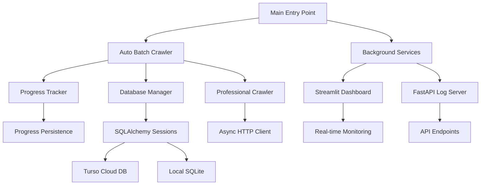

<div align="center">

# 🕷️ RatCrawler

### **Enterprise-Grade Web Crawler with Intelligent Batch Processing**

[](https://opensource.org/licenses/MIT)
[](https://www.python.org/)
[](https://www.sqlalchemy.org/)
[](https://streamlit.io/)
[](https://fastapi.tiangolo.com/)

_Inspired by the silent and agile nature of a rat, RatCrawler navigates the web efficiently, processing millions of URLs with intelligent batch processing, real-time monitoring, and automatic progress tracking._

</div>

---

## 📋 Table of Contents

- [🎯 Overview](#-overview)
- [✨ Key Features](#-key-features)
- [🏗️ System Architecture](#️-system-architecture)
- [� Quick Start](#-quick-start)
- [📦 Installation](#-installation)
- [🎮 Usage](#-usage)
- [⚙️ Configuration](#️-configuration)
- [� Monitoring & Analytics](#-monitoring--analytics)
- [🗄️ Database Schema](#️-database-schema)
- [🧪 Testing](#-testing)
- [🤝 Contributing](#-contributing)
- [📄 License](#-license)

---

## 🎯 Overview

RatCrawler is an **enterprise-grade web crawler** designed for large-scale data extraction with intelligent batch processing capabilities. Built with Python 3.13+ and modern async/await patterns, it efficiently processes millions of URLs while maintaining data integrity and system stability.

### 🌟 What Makes RatCrawler Special?

- **🚀 Intelligent Batch Processing**: Automatically processes 50 URLs at a time
- **💾 Automatic Progress Tracking**: Never lose progress - resume from exactly where you left off
- **📊 Real-time Monitoring**: Live dashboard and API monitoring
- **🔍 Advanced Backlink Analysis**: Discover and analyze website relationships
- **🛡️ Production-Ready**: Built for 24/7 operation with robust error handling
- **⚡ High Performance**: Async processing with configurable concurrency
- **📈 Scalable Architecture**: Handles databases with millions of URLs

---

## ✨ Key Features

### 🔥 Core Capabilities

| Feature                      | Description                                         | Status |
| ---------------------------- | --------------------------------------------------- | ------ |
| **Automatic Batch Crawling** | Process 50 URLs per batch with zero intervention    | ✅     |
| **Progress Persistence**     | Automatically saves progress and resumes on restart | ✅     |
| **Real-time Dashboard**      | Streamlit-powered monitoring interface              | ✅     |
| **API Monitoring**           | FastAPI-based log and metrics API                   | ✅     |
| **Backlink Discovery**       | Intelligent backlink extraction and analysis        | ✅     |
| **Multi-Database Support**   | SQLAlchemy with Turso cloud database integration    | ✅     |
| **Graceful Shutdown**        | Ctrl+C saves progress before stopping               | ✅     |
| **Session Management**       | Automatic session creation and tracking             | ✅     |
| **Error Recovery**           | Robust error handling with retry mechanisms         | ✅     |
| **Rate Limiting**            | Respectful crawling with configurable delays        | ✅     |

### 🎛️ Advanced Features

- **🔄 Auto-Resume**: Restarts exactly where it stopped
- **📦 Batch Configuration**: Configurable batch sizes (default: 50)
- **🎯 Smart URL Discovery**: Extracts URLs from backlinks database
- **📈 Progress Analytics**: Detailed crawl statistics and performance metrics
- **🛠️ Health Monitoring**: System health checks and alerts
- **🔐 Session Security**: Secure session management and tracking
- **📊 Data Export**: Multiple export formats (JSON, CSV)
- **🧪 Testing Suite**: Comprehensive test coverage

---

## 🏗️ System Architecture

### 🎯 High-Level Architecture



### 📁 Project Structure

```
ratcrawler/
├── 🏠 main.py                     # Main entry point (no arguments needed)
├── 📦 rat/                        # Core crawler package
│   ├── 🔄 auto_batch_crawler.py   # Automatic batch processing engine
│   ├── 📊 progress.py             # Progress tracking and persistence
│   ├── 🕷️ crawler.py              # Professional crawler implementation
│   ├── 🗄️ sqlalchemy_database.py  # Database abstraction layer
│   ├── 🔍 backlink.py             # Backlink analysis engine
│   ├── 📝 logger.py               # Enhanced logging system
│   ├── 🌐 log_api.py              # FastAPI log server
│   ├── ⚙️ config.py               # Configuration management
│   └── 🎯 batch_tracker.py        # Batch progress tracking
├── 📊 dashboard.py                # Streamlit monitoring dashboard
├── 🚀 run_enhanced_dashboard.py   # Dashboard launcher
├── 📈 monitor_databases.py        # Database monitoring utilities
├── 🧪 tests/                      # Comprehensive test suite
├── 📋 requirements.txt            # Python dependencies
└── 📄 README.md                   # This file
```

### � Component Architecture

#### 1. **Auto Batch Crawler** (`rat/auto_batch_crawler.py`)

```python
# Intelligent batch processing with automatic progress tracking
AutoBatchCrawler
├── Batch URL Discovery (SQL queries)
├── Progress Management (JSON persistence)
├── Session Creation (automatic)
├── Concurrent Processing (async/await)
└── Graceful Shutdown (signal handling)
```

#### 2. **Progress Tracker** (`rat/progress.py`)

```python
# Persistent progress tracking system
CrawlProgress
├── Current Page Tracking
├── Success/Failure Counters
├── Timestamp Management
├── Progress Persistence (JSON)
└── Resume Logic
```

#### 3. **Database Layer** (`rat/sqlalchemy_database.py`)

```python
# SQLAlchemy-based database abstraction
SQLAlchemyDatabase
├── Multi-Database Support (Turso, SQLite)
├── Session Management (context managers)
├── Query Optimization (paginated queries)
├── Schema Migration
└── Connection Pooling
```

#### 4. **Professional Crawler** (`rat/crawler.py`)

```python
# High-performance async web crawler
ProfessionalBacklinkCrawler
├── Async HTTP Client (aiohttp)
├── Rate Limiting (configurable delays)
├── Content Extraction (BeautifulSoup)
├── Error Handling (retry logic)
└── Backlink Discovery
```

---

## � Quick Start

Get RatCrawler running in under 2 minutes:

```bash
# 1. Clone the repository
git clone https://github.com/TheBoringRats/ratcrowler.git
cd ratcrawler

# 2. Install dependencies
pip install -r requirements.txt

# 3. Start automatic batch crawling (no arguments needed!)
python main.py
```

That's it! RatCrawler will:

- 🔍 Automatically find URLs in your backlinks database
- 📦 Process them in batches of 50
- 💾 Save progress after each batch
- 🔄 Resume from where it left off on restart
- 📊 Provide real-time monitoring at http://localhost:8501

---

## � Installation

### 📋 Prerequisites

- **Python 3.13+** (recommended) or Python 3.8+
- **Git** for cloning the repository
- **Internet connection** for crawling

### � Detailed Installation

#### 1. Clone Repository

```bash
git clone https://github.com/TheBoringRats/ratcrowler.git
cd ratcrawler
```

#### 2. Install Dependencies

**Option A: Using pip (recommended)**

```bash
pip install -r requirements.txt
```

**Option B: Using conda**

```bash
conda create -n ratcrawler python=3.13
conda activate ratcrawler
pip install -r requirements.txt
```

#### 3. Environment Setup (Optional)

For Turso cloud database integration:

```bash
# Copy environment template
cp .env.example .env

# Edit .env with your Turso credentials
TURSO_AUTH_TOKEN=your_token_here
TURSO_DATABASE_URL=your_database_url_here
```

#### 4. Verify Installation

```bash
# Test the installation
python main.py --help
```

### 📚 Dependencies

RatCrawler uses modern Python packages for optimal performance:

```python
# Core Crawling
requests>=2.28.0              # HTTP client
beautifulsoup4>=4.11.0        # HTML parsing
aiohttp>=3.8.0                # Async HTTP client

# Database & ORM
sqlalchemy>=2.0.0             # Modern ORM
python-dotenv>=1.0.0          # Environment management

# Web Framework & Monitoring
streamlit>=1.25.0             # Dashboard framework
fastapi>=0.100.0              # API framework
uvicorn>=0.23.0               # ASGI server

# Data Processing
pandas>=1.5.0                 # Data analysis
networkx>=2.8.0               # Graph algorithms

# Utilities
schedule>=1.1.0               # Task scheduling
psutil>=5.9.0                 # System monitoring
```

---

## 🎮 Usage

### 🔥 Automatic Mode (Recommended)

The simplest way to use RatCrawler - just run it!

```bash
# Start automatic batch crawling
python main.py
```

**What happens:**

1. 🔍 Scans backlinks database for URLs
2. � Processes 50 URLs at a time
3. 💾 Saves progress automatically
4. 🚀 Starts dashboard at http://localhost:8501
5. 📊 Starts log API at http://localhost:8000

### 🎛️ Command Line Options

```bash
# Show help and available commands
python main.py --help

# Check current crawl progress
python main.py --status

# Reset progress and start from page 1
python main.py --reset
```

### 📊 Progress Monitoring

RatCrawler provides multiple ways to monitor progress:

#### 1. **Command Line Output**

```bash
🕷️ RatCrawler - Automatic Batch Mode
==================================================
📊 Database Status:
   Total URLs: 83,093
   URLs per batch: 50
   Total pages: 1,662

📦 Processing Page 1
------------------------------
� Found 50 URLs in this batch
✅ Session 14 created in websitecrawler
🚀 Starting crawl of 50 URLs
```

#### 2. **Real-time Dashboard**

Access the Streamlit dashboard at: http://localhost:8501

- Live progress tracking
- Performance metrics
- Error monitoring
- Session management

#### 3. **API Monitoring**

Access the FastAPI log server at: http://localhost:8000

- RESTful API endpoints
- JSON log data
- System health metrics

#### 4. **Progress File**

Check `crawl_progress.json` for detailed progress:

```json
{
  "current_page": 15,
  "batch_size": 50,
  "total_urls": 83093,
  "urls_processed": 750,
  "successful_crawls": 720,
  "failed_crawls": 30,
  "last_update": "2025-09-02T10:30:15.123456"
}
```

### 🛠️ Advanced Usage

#### Custom Batch Sizes

If you need to modify the batch size, edit `rat/auto_batch_crawler.py`:

```python
# Default: 50 URLs per batch
crawler = AutoBatchCrawler(batch_size=100)  # Custom: 100 URLs per batch
```

#### Manual Batch Processing

Use the alternative batch crawler for more control:

```bash
# Process specific pages
python batch_crawl.py --start-page 10 --max-pages 5

# Custom batch size
python batch_crawl.py --batch-size 25
```

#### Database Management

```bash
# Monitor database status
python monitor_databases.py

# Test database connections
python -c "from rat.sqlalchemy_database import SQLAlchemyDatabase; db = SQLAlchemyDatabase(); print('Database OK')"
```

---

## ⚙️ Configuration

### � Basic Configuration

RatCrawler works out of the box with sensible defaults, but you can customize it:

#### Environment Variables (.env)

```bash
# Turso Cloud Database (Optional)
TURSO_AUTH_TOKEN=your_auth_token_here
TURSO_DATABASE_URL=libsql://your-db.turso.io

# Logging Configuration
LOG_LEVEL=INFO
LOG_FILE=ratcrawler.log

# Crawler Settings
DEFAULT_DELAY=1.5
MAX_CONCURRENT=5
BATCH_SIZE=50
```

#### Configuration Files

**`rat/config.py`** - Main configuration:

```python
DEFAULT_CONFIG = {
    'delay': 1.5,                    # Delay between requests
    'max_concurrent': 5,             # Concurrent connections
    'batch_size': 50,                # URLs per batch
    'timeout': 30,                   # Request timeout
    'user_agent': 'RatCrawler/3.0',  # User agent string
    'respect_robots': True,          # Follow robots.txt
    'max_retries': 3,                # Retry failed requests
}
```

### 🎯 Performance Tuning

#### For High-Volume Crawling

```python
# Increase concurrency (use with caution)
crawler = ProfessionalBacklinkCrawler(
    max_concurrent=10,    # More concurrent connections
    delay=1.0,           # Faster crawling
    timeout=15           # Shorter timeout
)
```

#### For Respectful Crawling

```python
# More conservative settings
crawler = ProfessionalBacklinkCrawler(
    max_concurrent=2,     # Fewer concurrent connections
    delay=3.0,           # Longer delays
    timeout=60           # More patience
)
```

### 📊 Logging Configuration

#### Log Levels

```python
# In rat/logger.py
LOG_LEVELS = {
    'DEBUG': 10,    # Detailed debugging info
    'INFO': 20,     # General information
    'WARNING': 30,  # Warning messages
    'ERROR': 40,    # Error messages
    'CRITICAL': 50  # Critical failures
}
```

#### Custom Log Format

```python
# Customize log format
LOG_FORMAT = '[%(asctime)s] %(levelname)s [%(name)s:%(lineno)s] %(message)s'
DATE_FORMAT = '%Y-%m-%d %H:%M:%S'
```

---

## 📊 Monitoring & Analytics

### 🎛️ Real-time Dashboard

The Streamlit dashboard provides comprehensive monitoring:

#### Features:

- **📈 Live Progress Tracking**: Real-time crawl progress
- **📊 Performance Metrics**: Speed, success rates, errors
- **🗄️ Database Status**: Connection status, table sizes
- **📝 Recent Logs**: Latest crawl activities
- **⚙️ System Health**: CPU, memory, disk usage
- **🔍 Session Management**: Active and completed sessions

#### Access:

```bash
# Dashboard automatically starts with main.py
# Or start manually:
python run_enhanced_dashboard.py
```

Navigate to: **http://localhost:8501**

### 🌐 API Monitoring

The FastAPI log server provides programmatic access:

#### Endpoints:

```bash
# System health
GET http://localhost:8000/health

# Recent logs
GET http://localhost:8000/logs?limit=100

# Crawl statistics
GET http://localhost:8000/stats

# Progress information
GET http://localhost:8000/progress

# Database status
GET http://localhost:8000/databases
```

#### Sample API Response:

```json
{
  "status": "running",
  "current_page": 15,
  "total_pages": 1662,
  "urls_processed": 750,
  "success_rate": 96.0,
  "average_speed": 12.5,
  "uptime": "2 hours 15 minutes"
}
```

### 📋 Progress Persistence

RatCrawler automatically saves progress in `crawl_progress.json`:

```json
{
  "current_page": 15,
  "batch_size": 50,
  "total_urls": 83093,
  "urls_processed": 750,
  "successful_crawls": 720,
  "failed_crawls": 30,
  "last_update": "2025-09-02T10:30:15.123456",
  "session_id": 14,
  "db_name": "websitecrawler",
  "is_running": false,
  "completion_percentage": 0.9
}
```

### 📈 Performance Metrics

Monitor key performance indicators:

- **Throughput**: URLs processed per minute
- **Success Rate**: Percentage of successful crawls
- **Error Rate**: Failed requests and reasons
- **Response Time**: Average page load times
- **Memory Usage**: System resource consumption
- **Database Growth**: Storage usage over time

---

#### Backlink Analysis

```python
from backlinkprocessor import BacklinkProcessor

processor = BacklinkProcessor(delay=1.0, usedatabase=True)
processor.crawl_backlinks(['https://example.com'], max_depth=2)
processor.build_link_graph()
pagerank_scores = processor.calculate_pagerank()
```

### Rust Version

#### Basic Commands

```bash
# Web crawling
./target/release/rat-crawler crawl https://example.com

# Backlink analysis
./target/release/rat-crawler backlinks https://example.com/page

# Integrated analysis
./target/release/rat-crawler integrated https://example.com

# Domain analysis
./target/release/rat-crawler domain example.com
```

#### Advanced Usage

```bash
# Multiple URLs with custom settings
./target/release/rat-crawler crawl \
  --url https://example.com \
  --url https://example.org \
  --max-pages 500 \
  --respect-robots-txt
```

---

## � Weekly Crawling Workflow

RatCrawler implements a sophisticated **7-day automated workflow** that systematically crawls websites, extracts backlinks, and analyzes domain authority. The system automatically discovers new domains and expands the crawl frontier.

### 🗓️ Weekly Schedule

| Day           | Time        | Activity                   | Description                                               |
| ------------- | ----------- | -------------------------- | --------------------------------------------------------- |
| **Monday**    | 08:00       | 🔗 **Backlink Extraction** | Crawl all seed URLs, extract backlinks, store in database |
| **Tuesday**   | 08:00       | 🌐 **Seed Domain Crawl**   | Deep crawl of all pages within seed domains               |
| **Wednesday** | 08:00       | 🏗️ **Subdomain Analysis**  | Crawl discovered subdomains and analyze content           |
| **Thursday**  | 08:00       | 🏗️ **Subdomain Analysis**  | Continue subdomain crawling (extended session)            |
| **Friday**    | 08:00       | 📥 **Data Retrieval**      | Extract and save backlink data for analysis               |
| **Saturday**  | 08:00       | 📥 **Data Retrieval**      | Additional backlink data extraction                       |
| **Sunday**    | 08:00       | 📊 **System Status**       | Generate reports and system health check                  |
| **Daily**     | 00:00-02:00 | ⚙️ **Engine Services**     | 2-hour maintenance window for data processing             |

### 🔄 Workflow Details

#### Day 1: Backlink Extraction (Monday)

```python
# Configuration for backlink-focused crawling
backlink_config = {
    'max_depth': 1,          # Shallow crawl for backlinks
    'max_pages': 50,         # Limited pages per domain
    'analyze_backlinks': True,
    'stay_on_domain': False  # Allow external link discovery
}

# Extract backlinks from all seed URLs
results = crawler.comprehensive_crawl(seed_urls)
```

**Key Activities:**

- Visit all URLs in `seed_urls.json`
- Extract outbound links (backlinks for other sites)
- Store backlinks in database with metadata
- Calculate initial domain authority scores
- **Auto-Discovery**: Identify high-authority domains (score > 50)
- **Auto-Expansion**: Add valuable domains to `seed_urls.json`

#### Day 2: Seed Domain Deep Crawl (Tuesday)

```python
# Configuration for comprehensive domain coverage
domain_config = {
    'max_depth': 4,          # Deeper exploration
    'max_pages': 200,        # More pages per domain
    'stay_on_domain': True,  # Stay within seed domains
    'analyze_backlinks': False
}
```

**Key Activities:**

- Crawl all pages within seed domains
- Extract comprehensive content and metadata
- Build internal link graphs
- Identify subdomains for further analysis

#### Days 3-4: Subdomain Analysis (Wednesday-Thursday)

```python
# Configuration for subdomain exploration
subdomain_config = {
    'max_depth': 3,
    'max_pages': 150,
    'stay_on_domain': False,
    'analyze_backlinks': True
}

# Get discovered subdomains from database
subdomains = crawler.database.get_discovered_subdomains()
```

**Key Activities:**

- Analyze previously discovered subdomains
- Crawl subdomain content and extract backlinks
- Update domain authority scores
- Identify additional crawl targets

#### Daily Engine Services (00:00-02:00)

```python
# 2-hour automated maintenance window
def run_daily_engine_services():
    # Update domain authority scores
    domain_scores = crawler.database.get_domain_authority_scores()

    # Recalculate PageRank scores
    pagerank_scores = crawler.database.get_pagerank_scores()

    # Clean up old data (keep last 30 days)
    cleanup_count = crawler.database.cleanup_old_data(days_old=30)

    # Analyze recent backlinks
    recent_backlinks = crawler.database.get_recent_backlinks(hours=24)
```

**Key Activities:**

- **Domain Authority Updates**: Recalculate domain scores
- **PageRank Recalculation**: Update page importance scores
- **Data Cleanup**: Remove old records while preserving recent data
- **Backlink Analysis**: Process new backlinks from recent crawls
- **System Optimization**: Database maintenance and performance tuning

### 🎯 Smart Domain Discovery

```python
def add_necessary_domains_to_seeds(crawler, threshold_score=50):
    """Add high-authority domains to seed URLs"""
    domain_scores = crawler.database.get_domain_authority_scores()

    for domain, score in domain_scores.items():
        if score >= threshold_score and domain not in current_seeds:
            # Add to seed_urls.json
            new_url = f"https://{domain}"
            seed_urls.append(new_url)
```

**Discovery Criteria:**

- Domain Authority Score > 50
- Not already in seed URLs
- Successful previous crawls
- Quality backlink profile

### 📊 Monitoring & Reporting

#### System Status (Sunday)

```python
def show_system_status():
    all_backlinks = crawler.get_all_backlinks()
    crawled_urls = crawler.database.get_all_crawled_urls()

    print(f"Total pages crawled: {len(crawled_urls)}")
    print(f"Total backlinks: {len(all_backlinks)}")
    print(f"Database size: {os.path.getsize('website_crawler.db')} bytes")
```

#### Real-time Monitoring

- **Database Health**: Connection status and performance
- **Crawl Progress**: Pages processed, errors encountered
- **Backlink Growth**: New backlinks discovered daily
- **Domain Expansion**: New domains added to seed list

### 🚀 Running the Workflow

#### Automated Mode (Recommended)

```bash
# Start the automated weekly crawler
python3 main.py
```

#### Manual Testing

```bash
# Test individual components
python3 test_workflow.py

# Run specific day functions
python3 -c "from main import perform_backlink_extraction; perform_backlink_extraction()"
```

#### Configuration

```python
# Customize workflow in main.py
config = {
    'delay': 1.5,              # Request delay (seconds)
    'max_depth': 3,            # Crawl depth
    'max_pages': 100,          # Pages per session
    'db_path': 'website_crawler.db',
    'domain_threshold': 50,    # Minimum authority for auto-addition
    'analyze_backlinks': True,
    'stay_on_domain': True
}
```

### 📈 Benefits of This Workflow

1. **Systematic Coverage**: Ensures comprehensive crawling of seed domains
2. **Smart Discovery**: Automatically finds valuable new domains
3. **Resource Management**: Distributes crawling load across the week
4. **Data Freshness**: Regular updates while avoiding duplicate work
5. **Scalability**: Easy to add new domains and adjust crawl parameters
6. **Maintenance**: Automated cleanup and optimization
7. **Monitoring**: Regular health checks and reporting

### 🔧 Customization

#### Adjusting the Schedule

```python
# Modify schedule in main.py
schedule.every().monday.at("09:00").do(perform_backlink_extraction)  # Change time
schedule.every(2).days.do(perform_subdomain_crawl)  # Change frequency
```

#### Modifying Discovery Criteria

```python
# Adjust domain addition threshold
add_necessary_domains_to_seeds(crawler, threshold_score=75)  # Higher bar
```

#### Custom Engine Services

```python
# Add custom maintenance tasks
def custom_engine_task():
    # Your custom processing logic
    pass

# Add to daily services
schedule.every().day.at("01:00").do(custom_engine_task)
```

---

## 🔍 Google Trends Integration

### Features

- **50+ Countries** supported
- **Real-time Trends** from Google Trends RSS
- **Article Summaries** with intelligent extraction
- **Rate Limiting** protection
- **JSON Export** with structured data

### Usage

```bash
# Basic trends fetch
cd engine
python3 googletrends.py

# Advanced configuration
python3 googletrends.py
  --limit 10
  --delay 5
  --summaries
  --output custom_trends.json
  --max-retries 3
```

### Sample Output

```json
{
  "United States": [
    {
      "trend_title": "breaking news",
      "approx_traffic": "1M+",
      "published": "2025-08-29T12:00:00Z",
      "news_items": [
        {
          "title": "News Article Title",
          "url": "https://news.example.com/article",
          "source": "News Source"
        }
      ],
      "summary": "Article summary extracted from content..."
    }
  ]
}
```

---

## 🗄️ Database Schema

RatCrawler uses a sophisticated multi-database architecture powered by SQLAlchemy for optimal performance and scalability.

### 🏗️ Database Structure

#### **Primary Databases**

1. **�️ Crawler Database** (`websitecrawler*`)

   - Stores crawled page content and metadata
   - Session management and tracking
   - Performance metrics and statistics

2. **🔗 Backlink Database** (`*backlink`)
   - Backlink relationships between domains
   - Source and target URL mappings
   - Link discovery and analysis data

#### **Core Tables Schema**

##### 📄 Crawled Pages Table

```sql
CREATE TABLE crawled_pages (
    id INTEGER PRIMARY KEY AUTOINCREMENT,
    url TEXT UNIQUE NOT NULL,
    title TEXT,
    content TEXT,
    word_count INTEGER,
    http_status_code INTEGER,
    crawl_timestamp DATETIME DEFAULT CURRENT_TIMESTAMP,
    session_id TEXT,
    content_hash TEXT,
    meta_description TEXT,
    meta_keywords TEXT,
    response_time_ms REAL,
    page_size_bytes INTEGER,
    last_modified DATETIME,
    is_duplicate BOOLEAN DEFAULT FALSE,
    error_message TEXT
);
```

##### 🔗 Backlinks Table

```sql
CREATE TABLE backlinks (
    id INTEGER PRIMARY KEY AUTOINCREMENT,
    source_url TEXT NOT NULL,
    target_url TEXT NOT NULL,
    anchor_text TEXT,
    link_type TEXT,
    discovered_timestamp DATETIME DEFAULT CURRENT_TIMESTAMP,
    session_id TEXT,
    is_internal BOOLEAN DEFAULT FALSE,
    link_position INTEGER,
    link_context TEXT,
    domain_authority_score REAL,
    page_authority_score REAL
);
```

##### 📊 Crawl Sessions Table

```sql
CREATE TABLE crawl_sessions (
    session_id TEXT PRIMARY KEY,
    start_timestamp DATETIME DEFAULT CURRENT_TIMESTAMP,
    end_timestamp DATETIME,
    status TEXT DEFAULT 'active',
    pages_crawled INTEGER DEFAULT 0,
    pages_failed INTEGER DEFAULT 0,
    total_urls INTEGER DEFAULT 0,
    config_data TEXT,
    seed_urls TEXT,
    user_agent TEXT,
    crawl_type TEXT
);
```

##### 📈 Domain Authority Table

```sql
CREATE TABLE domain_authority (
    domain TEXT PRIMARY KEY,
    authority_score REAL,
    page_rank REAL,
    trust_rank REAL,
    spam_score REAL,
    backlink_count INTEGER,
    referring_domains INTEGER,
    last_updated DATETIME DEFAULT CURRENT_TIMESTAMP,
    calculation_method TEXT
);
```

### 🔄 Database Operations

#### **Session Management**

```python
# Create new crawl session
session_id, db_name = db.create_crawl_session(
    seed_urls=['https://example.com'],
    config={'batch_size': 50, 'delay': 1.5}
)

# Store crawled page
db.store_crawled_page(
    session_id=session_id,
    url='https://example.com',
    title='Example Page',
    content='Page content...',
    status_code=200
)

# Finish session
db.finish_crawl_session(session_id, 'completed')
```

#### **Batch Processing**

```python
# Get paginated URLs for batch processing
urls = db.get_backlink_urls_batch(page=1, limit=50)

# Count total URLs available
total_count = db.get_total_backlink_urls_count()
```

#### **Progress Tracking**

```python
# Load saved progress
progress = progress_tracker.load_progress()

# Update progress after batch
progress_tracker.update_progress(
    successful=45,
    failed=5
)

# Save current state
progress_tracker.save_progress()
```

### 🌩️ Turso Cloud Integration

RatCrawler supports Turso cloud databases for distributed deployments:

```bash
# Environment setup
TURSO_AUTH_TOKEN=your_token_here
TURSO_DATABASE_URL=libsql://your-db.turso.io

# Automatic database selection
# Local SQLite for development
# Turso cloud for production
```

**Benefits:**

- 🌍 Global distribution
- ⚡ Edge database performance
- 🔄 Automatic synchronization
- 💾 Persistent cloud storage
- 📈 Scalable architecture

---

## 🧪 Testing

RatCrawler includes a comprehensive test suite to ensure reliability and performance.

### 🚀 Quick Test

```bash
# Run all tests
pytest tests/ -v

# Run specific test categories
pytest tests/test_crawler.py -v          # Crawler tests
pytest tests/test_database.py -v         # Database tests
pytest tests/test_batch_processing.py -v # Batch processing tests
```

### 📋 Test Coverage

```bash
# Generate coverage report
pytest --cov=rat --cov-report=html tests/

# View coverage in browser
open htmlcov/index.html
```

### 🎯 Available Tests

| Test Category         | Description                  | Files                   |
| --------------------- | ---------------------------- | ----------------------- |
| **Unit Tests**        | Individual component testing | `test_*.py`             |
| **Integration Tests** | Multi-component workflows    | `test_integrated_*.py`  |
| **Performance Tests** | Load and stress testing      | `test_performance_*.py` |
| **Database Tests**    | Data integrity and queries   | `test_database_*.py`    |
| **API Tests**         | Dashboard and API endpoints  | `test_api_*.py`         |

### 🔧 Test Configuration

Create `pytest.ini` for custom test settings:

```ini
[tool:pytest]
testpaths = tests
python_files = test_*.py
python_classes = Test*
python_functions = test_*
addopts = -v --tb=short --strict-markers
markers =
    slow: marks tests as slow
    integration: marks tests as integration tests
    unit: marks tests as unit tests
```

### 🧪 Sample Test

```python
def test_auto_batch_crawler():
    """Test automatic batch crawling functionality"""

    # Initialize crawler
    crawler = AutoBatchCrawler(batch_size=10)

    # Test URL discovery
    urls = crawler.get_backlink_urls_batch(page=1, limit=10)
    assert len(urls) <= 10
    assert all(url.startswith(('http://', 'https://')) for url in urls)

    # Test progress tracking
    initial_progress = progress_tracker.load_progress()
    assert 'current_page' in initial_progress
    assert 'batch_size' in initial_progress
```

---

## 🤝 Contributing

We welcome contributions to RatCrawler! Here's how you can help:

### 🚀 Getting Started

1. **Fork the Repository**

   ```bash
   git clone https://github.com/yourusername/ratcrowler.git
   cd ratcrowler
   ```

2. **Create Development Environment**

   ```bash
   python -m venv venv
   source venv/bin/activate  # Linux/Mac
   # or
   venv\Scripts\activate     # Windows
   pip install -r requirements.txt
   ```

3. **Create Feature Branch**
   ```bash
   git checkout -b feature/your-feature-name
   ```

### 📝 Development Guidelines

#### **Code Style**

- Follow PEP 8 Python style guidelines
- Use meaningful variable and function names
- Add docstrings to all functions and classes
- Keep functions focused and concise

#### **Testing Requirements**

- Write tests for new features
- Ensure all tests pass before submitting
- Maintain or improve test coverage
- Include both unit and integration tests

#### **Documentation**

- Update README.md for new features
- Add inline code comments
- Include usage examples
- Update API documentation

### 🔍 Code Review Process

1. **Submit Pull Request**

   - Clear description of changes
   - Reference related issues
   - Include test results
   - Update documentation

2. **Review Criteria**
   - Code quality and style
   - Test coverage
   - Performance impact
   - Documentation completeness

### 🐛 Bug Reports

When reporting bugs, please include:

- Python version and OS
- Complete error traceback
- Steps to reproduce
- Expected vs actual behavior
- Relevant configuration

### 💡 Feature Requests

For new features, please provide:

- Clear use case description
- Implementation suggestions
- Potential impact assessment
- Alternative approaches considered

---

## 📄 License

This project is licensed under the **MIT License** - see the [LICENSE](LICENSE) file for details.

```
MIT License

Copyright (c) 2025 TheBoringRats

Permission is hereby granted, free of charge, to any person obtaining a copy
of this software and associated documentation files (the "Software"), to deal
in the Software without restriction, including without limitation the rights
to use, copy, modify, merge, publish, distribute, sublicense, and/or sell
copies of the Software, and to permit persons to whom the Software is
furnished to do so, subject to the following conditions:

The above copyright notice and this permission notice shall be included in all
copies or substantial portions of the Software.

THE SOFTWARE IS PROVIDED "AS IS", WITHOUT WARRANTY OF ANY KIND, EXPRESS OR
IMPLIED, INCLUDING BUT NOT LIMITED TO THE WARRANTIES OF MERCHANTABILITY,
FITNESS FOR A PARTICULAR PURPOSE AND NONINFRINGEMENT.
```

---

## 🙏 Acknowledgments

RatCrawler is built with and inspired by amazing open-source projects:

### 🛠️ Core Dependencies

- **[SQLAlchemy](https://www.sqlalchemy.org/)** - Powerful Python SQL toolkit
- **[Streamlit](https://streamlit.io/)** - Beautiful data apps
- **[FastAPI](https://fastapi.tiangolo.com/)** - Modern web framework
- **[BeautifulSoup](https://www.crummy.com/software/BeautifulSoup/)** - HTML parsing
- **[aiohttp](https://docs.aiohttp.org/)** - Async HTTP client

### 🌟 Special Thanks

- **Python Community** for the incredible ecosystem
- **Turso** for cloud database infrastructure
- **GitHub** for hosting and collaboration tools
- **Open Source Contributors** worldwide

### 📚 Inspiration

- Google's PageRank algorithm
- Scrapy framework architecture
- Modern async/await patterns
- Production web crawling best practices

---

<div align="center">

## 🚀 Ready to Start Crawling?

**Get RatCrawler running in under 2 minutes:**

```bash
git clone https://github.com/TheBoringRats/ratcrowler.git
cd ratcrawler
pip install -r requirements.txt
python main.py
```

**⭐ Star us on GitHub if you find this project useful!**

**🐛 [Report Issues](https://github.com/TheBoringRats/ratcrowler/issues) | 💡 [Request Features](https://github.com/TheBoringRats/ratcrowler/discussions) | 📖 [Documentation](https://github.com/TheBoringRats/ratcrowler/wiki)**

---

**Made with ❤️ by [TheBoringRats](https://github.com/TheBoringRats)**

_Building tools that make the web more accessible, one URL at a time._

</div>

### Python Database (`website_crawler.db`)

```sql
-- Crawled content
crawled_pages (
    id, url, title, content, meta_description,
    word_count, response_time_ms, crawl_date
)

-- Backlinks data
backlinks (
    id, source_url, target_url, anchor_text,
    context, page_title, domain_authority, is_nofollow
)

-- Analysis results
domain_scores (domain, authority_score, total_backlinks)
pagerank_scores (url, pagerank_score)
```

### Rust Database (`web_crawl.db`)

```sql
-- Similar schema optimized for Rust
crawl_sessions, crawled_pages, crawl_errors
backlinks, domain_scores, pagerank_scores
```

---

## ⚙️ Configuration

### Python Configuration

```python
config = {
    'delay': 1.5,           # Seconds between requests
    'max_depth': 3,         # Maximum crawl depth
    'max_pages': 100,       # Pages per session
    'user_agent': 'Custom-Agent/1.0',
    'db_path': 'crawler.db', # Database file
    'export_json': True,    # Enable JSON export
    'export_csv': False,    # Enable CSV export
    'analyze_backlinks': True,  # Enable backlink analysis
    'recrawl_days': 7       # Days before recrawling
}
```

### Rust Configuration

```rust
let config = CrawlerConfig {
    user_agent: "RatCrawler/1.0".to_string(),
    timeout: Duration::from_secs(10),
    max_redirects: 5,
    max_depth: 3,
    max_pages: 100,
    delay: Duration::from_millis(1500),
    respect_robots_txt: true,
};
```

---

## 🧪 Testing

### Python Tests

```bash
# Run all tests
python3 -m pytest test_*.py -v

# Run specific test
python3 test_crawler.py

# Quick component test
python3 test_quick.py
```

### Rust Tests

```bash
# Run all tests
cargo test

# Run with verbose output
cargo test -- --nocapture

# Run specific test
cargo test test_crawler
```

### Integration Tests

```bash
# Test full crawling pipeline
python3 -c "
from crawler import EnhancedProductionCrawler
crawler = EnhancedProductionCrawler({'max_pages': 5})
results = crawler.comprehensive_crawl(['https://httpbin.org'])
print(f'Success: {results.get(\"success\")}')
"
```

---

## 🤝 Contributing

We welcome contributions! Please see our [Contributing Guide](CONTRIBUTING.md) for details.

### Development Setup

1. **Fork the repository**
2. **Clone your fork**

   ```bash
   git clone https://github.com/yourusername/ratcrawler.git
   cd ratcrawler
   ```

3. **Create a feature branch**

   ```bash
   git checkout -b feature/amazing-feature
   ```

4. **Make your changes**
5. **Run tests**

   ```bash
   # Python
   python3 -m pytest

   # Rust
   cargo test
   ```

6. **Submit a pull request**

### Code Style

- **Python**: Follow PEP 8, use type hints
- **Rust**: Use `cargo fmt` and `cargo clippy`
- **Documentation**: Update README for new features

---

## 📄 License

This project is licensed under the **MIT License** - see the [LICENSE](LICENSE) file for details.

```text
MIT License

Copyright (c) 2025 TheBoringRats

Permission is hereby granted, free of charge, to any person obtaining a copy
of this software and associated documentation files (the "Software"), to deal
in the Software without restriction, including without limitation the rights
to use, copy, modify, merge, publish, distribute, sublicense, and/or sell
copies of the Software, and to permit persons to whom the Software is
furnished to do so, subject to the following conditions:

The above copyright notice and this permission notice shall be included in all
copies or substantial portions of the Software.
```

---

## 🙏 Acknowledgments

### Core Team

- **TheBoringRats** - Project maintainers and core developers
- **swadhinbiswas** - Core developer and contributor

### Technologies Used

- **Python** - Primary implementation language
- **Rust** - High-performance implementation
- **SQLite** - Database engine
- **Tokio** - Async runtime for Rust
- **BeautifulSoup4** - HTML parsing for Python
- **Scraper** - HTML parsing for Rust

### Inspiration

- Inspired by the need for efficient, stealth web crawling
- Built for researchers, SEO analysts, and developers
- Thanks to the open-source community for amazing tools

### Special Thanks

- **Rust Community** - For excellent documentation and crates
- **Python Community** - For rich ecosystem and libraries
- **Contributors** - For their valuable contributions

---

<div align="center">

**Made with ❤️ by TheBoringRats**

[🐛 Report Bug](https://github.com/TheBoringRats/ratcrawler/issues) • [💡 Request Feature](https://github.com/TheBoringRats/ratcrawler/issues) • [📧 Contact](mailto:theboringrats@gmail.com)

---

_⭐ Star us on GitHub if you find this project useful!_

</div>
